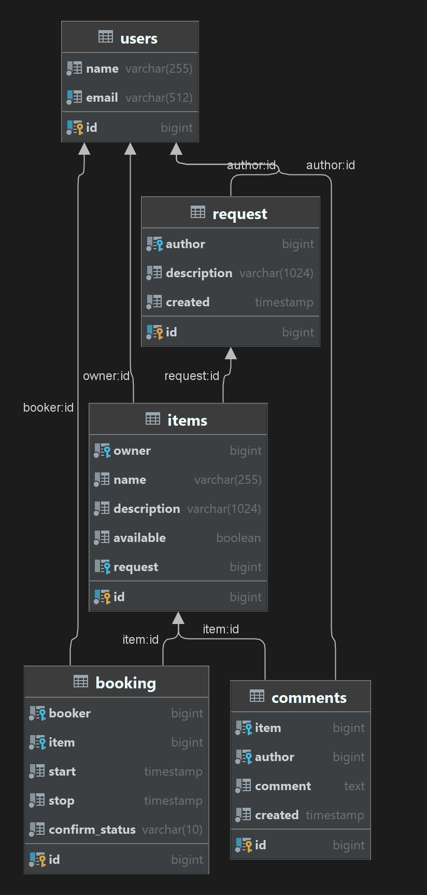

# Проект 6-го модуля Яндекс Практикума

## *java-shareit*

## Rest API приложения shareit

Сервер приложения веб-сервиса (и его gateway).
========================
#### [Ссылка API swagger-ui документации и доступных эндпоинтов](http://localhost:8080/swagger-ui/index.html)
Эта ссылка будет работать при запущенном приложении.

## Быстрый старт
### Требования
- Java Platform (JDK) 11
- Apache Maven 4.x

Находясь в каталоге в командной строке, введите:

`./mvn package`

`java -jar gateway/target/gateway-0.0.1-SNAPSHOT.jar`

`java -jar server/target/server-0.0.1-SNAPSHOT.jar`

## Быстрый старт Docker
### Требования
- Java Platform (JDK) 11
- Apache Maven 4.x
- Docker client (Docker-compose)

Находясь в каталоге в командной строке, введите:

`./mvn package`

`docker-compose up`
